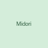

# Enstars Translation Archive - Instructions

## Folder Structure
```
your-repo/
├── index.html          ← Home page with story list and filters
├── styles.css          ← All styling (rarely needs editing)
├── sprites/            ← Character sprite images
│   └── midori.png, chiaki.png, etc.
├── story-images/       ← Banner images for each story
│   └── example-event.png, etc.
└── stories/            ← All your story HTML files
    ├── _TEMPLATE.html  ← Copy this for new stories
    └── example-story.html
```

## How to Add a New Story

### Step 1: Create the story file
1. Copy `stories/_TEMPLATE.html`
2. Rename it (e.g., `ryuseitai-event-ch1.html`)
3. Edit the content inside

### Step 2: Add it to the index
Open `index.html` and add a new story card:

```html
<div class="story-card" data-type="event" data-units="ryuseitai">
  <a href="stories/ryuseitai-event-ch1.html">
    <div class="story-image">
      
    </div>
    <div class="story-info">
      <span class="story-type event">Event</span>
      <h3>Your Story Title</h3>
      <p class="description">Brief description...</p>
      <div class="featuring">
        <span class="featuring-label">Featuring:</span>
        
        
      </div>
    </div>
  </a>
</div>
```

### Data attributes for filtering:
- `data-type`: main-story, event, scout, or other
- `data-units`: unit name(s), comma-separated if multiple
  - Options: trickstar, fine, ryuseitai, alkaloid, eden, valkyrie, undead, rabits, akatsuki, knights, switch, mam, doublesface, crazeb, 2wink

## Adding Character Sprites
1. Save sprite images to the `sprites/` folder
2. Name them consistently: `charactername.png` (lowercase)
3. For multiple expressions: `charactername-happy.png`, `charactername-sad.png`
4. Recommended size: 80x80 to 200x200 pixels, square

## Adding Story Images
1. Save banner images to the `story-images/` folder
2. Recommended size: around 180x140 pixels
3. Can be event banners, screenshots, or custom art

## Character Color Classes
Already set up in styles.css:
- Ryuseitai: midori, chiaki, kanata, tetora, shinobu
- Trickstar: subaru, hokuto, makoto, mao
- UNDEAD: rei, kaoru, koga, adonis
- fine: eichi, wataru, tori, yuzuru
- Knights: leo, izumi, ritsu, arashi, tsukasa
- Switch: natsume, tsumugi, sora
- Special: player, narrator

Need more characters? Add them to styles.css following the same pattern!

## Tips
- Keep file names lowercase with hyphens (no spaces)
- Test locally before pushing to GitHub
- The filters work by matching data-type and data-units attributes
